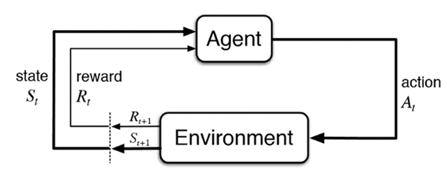

# Jumbo Mana technical test

This document details all the steps that I took to attemp to solve the Jumbo Mana technical recruitement test.

## Step 0 : Running
Versions:

* Python 3.11.3
* Cuda 11.8

To run this program, execute the following commands in a **miniconda** terminal:
 
``` 
conda env create -f conda_env.yml
conda activate conda_env
python main.py
```
A window will pop up showing you the view of the matrix. Close the window to see the next step for a total of 20 steps.

you can adjust the number of steps in the main.py file.


## Step 1 : Learning
The test requires the use and manipulation of reinforcement learning techniques, which I am not yet familiar with. So I started by watching a YouTube tutorial and creating a small test project to get started.

**video link** : https://www.youtube.com/watch?v=Mut_u40Sqz4&t=895s

These are the notes I took while following the tutorial:
### Notes: 

**How RL works:** Reinforcement learning focuses on teaching agents through trial and error.

**Agent:** the actor operating within the environment, it is usually governed by a policy (a rule that decides which action to take)

**Environment:** the world in which the agent can operate

**Action:** the agent can do something within the environment known as an action

**Reward and observation**: in return, the agent recieves an award and a view of what the environment looks like after acting on it.

The agent takes actions in order to maximize the word recieved from the environment.



#### 1-Setup:
```
pip install stable-baselines3[extra]
```
**Stable baselines documentation:** https://stable-baselines3.readthedocs.io/en/master/

#### 2-Enviroments: Environments can be eiter real or simulated. Simulated environments give you the ability to trial and train a model in a safe and cost effective model.

**OpenAI Gym** : provides an easy way to build environments for rl agents.

#### Cartpole environment: 

```python
environment_name = "CartPole-v0"
env = gym.make(environment_name, render_mode="human")
episodes = 5
for episode in range(1, episodes+1):
    state = env.reset()
    done = False
    truncated = False
    score = 0 
    
    while not done:
        env.render()
        action = env.action_space.sample()
        n_state, reward, done, truncated, info = env.step(action)
        score+=reward
    print('Episode:{} Score:{}'.format(episode, score))
env.close()
```

Here I loaded the premade cartpole environment from OpenAI gym.

The model goes through 5 iterations (episodes)

in the beginning of each episode, the environment is reset to its default values, and the model takes a random action from the action space (in this case 0 or 1) and the score is calculated for each episode

* **Action space**: The action is a ndarray with shape (1,) which can take values {0, 1} indicating the direction of the fixed force the cart is pushed with
* **Observation space** : The observation is a ndarray with shape (4,) with the values corresponding to the following positions and velocities (cart position, cart velocity, pole angle, pole angular velocity)


## Step 2: Creating a custom environment
For this step I am creating the custom matrix environment in which my agent will operate.

The environment for this problem is a 12x12 matrix with 4 main obstacles

To create this environment, I have created a new class **MatrixEnv** which inherits from **gym.Env**

I then implemented the __Init__(), **reset()**, **step()**, and **render()** functions for my new class

**__init__()**:
 * The **action space** is a Discrete space of size 4, meaning the agent can choose between 4 different moves : 0 for **up**, 1 for **down**, 2 for **left** and 3 for **right**

 * The **observation space** is a Discrete space of 12x12 to represent the matrix

**reset()**:
*   The player and agent are placed randomly on the grid
*   The goal state is the position behind the player in relation to the agent.
*   To avoid the agent being stuck with no way to bypass the player, the player cannot spawn on the edges of the map
*   The player is also always placed in a position that guarantees that the goal position is not placed within an obstacle

**step()**:
* The agent chooses between 4 possible moves
*  **Reward system**:
   *  With every move, the reward is initialized at 0
   *  With every move, the agent is given a small reward penalty of 0.04, this should theoretically discourage the agent from making too many unnecessary moves
   *  If the agent attemps to move into an obstacle, outside the map, or into the players position, it is given a reward penalty of 0.75 and the move isn't taken into consideration.
   *  If the agent moves into a position it has already been to before, it is given a penalty of 0.25
   *  When the agent arrives at its goal state, it's given a reward of 1.0
   *  The distance to the goal state is calculated before and after the move is made. The two moves are then compared:
      *  If the agent moves closer to the target, the reward is inversly proportional to the new distance, means the closer it gets, the bigger the reward. This should theoritically encourage the agent to move closer and closer to the target.
      I  
      * If the agent moves away from the target, it is given a reward penalty of 0.25   
    
    *   To avoid being stuck in an infinite loop, I keep track of the total reward accumulated, if it reaches below a certain threshold (0.5 * (12**2)), we can assume the agent is "lost" and the game should be restarted.

**render**: 
The matrix is displayed as shown here


*The player is displayed in **Yellow**
* The agent is displayed in **Blue**
* The target is displayed in **Green**

## Step 3 : training a model
In the limited time I had to finish this assignment, learning to develop and creating my own AI model from scratch has proven to be too complicated, so I decided to use an existing model from the stable baselines 3 library.

I tried a few different models and the one that gave me the best result is stable_baselines3.PPO

```python
from stable_baselines3 import PPO
model = PPO("MlpPolicy", env, verbose=1)  
env.reset()
model.learn(total_timesteps=40000)
```
## 4 - results
While not perfect, the agent seems to almost always move in the general direction of the goal state, but starts to struggle when it gets close. This could be do to the model I used not being very adapted to the situation or some other factors I do not yet understand.
With the limited time I have to complete this, I feel this is the best result I could achieve right now.
